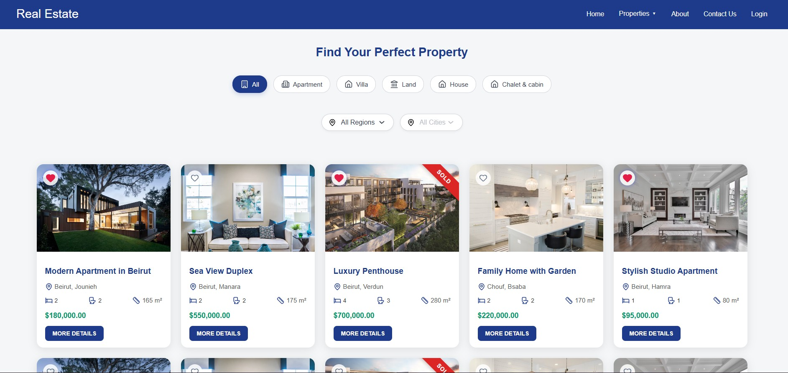
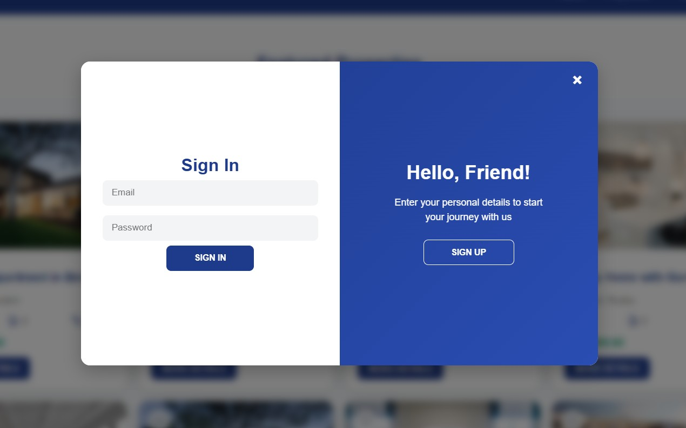

# 🏠 Real-Estate Property MERN Booking Platform

A simple real-estate web application built with **React (frontend)** and **Node/Express + MongoDB (backend — planned)**.  
Users can browse properties for sale/rent, mark favorites, and (in future) register, login, and manage their own listings.

---

## 🔗 Live Demo

<p align="center">
  <a href="https://6936b7ce9520bf16eaf56446--wondrous-peony-99def4.netlify.app/" target="_blank">
    
  </a>
</p>

---

## 📸 Preview

<p align="center">
<p>📸 Purchases with Filtering Screen</p>
    
</p>

<p align="center">
<p>📸 My Favorites Screen</p>
    
</p>

<p align="center">
<p>📸 Property Details</p>
    
</p>

<p align="center">
<p>📸 Signup/Login</p>
    
</p>

---

## 📦 Table of Contents

- [Features](#-features)
- [Tech Stack](#-tech-stack)
- [Getting Started](#-getting-started)
- [Project Structure](#-project-structure)
- [Usage](#-usage--how-it-works)
- [Future Improvements](#-future-improvements)
- [License](#-license)
- [Contact](#-contact--author)

---

## ✅ Features

- Browse a list of apartments (sale/rent) with details — price, area, bedrooms, location, images.
- Filter by **property type** (Apartment, Villa, Land, House, Commercial, etc.).
- Filter by **location** (region / city).
- ❤️ **Favorites:** mark/unmark properties, stored in localStorage.
- 📱 Responsive UI (desktop & mobile).
- 🧩 Modular structure (components, pages, utils, data) — ready for MERN backend integration.

---

## 🛠 Tech Stack

- **Frontend:** React, React Router, React-Slick (carousel), Lucide-React (icons)
- **Styling:** Pure CSS (component-based organization)
- **State & Storage:** React Hooks + localStorage
- **Backend (planned):** Node.js, Express.js, MongoDB
- **Build / Deployment:** Vite or Create React App

---

## 🚀 Getting Started

### 1️⃣ Clone the repository

```bash
git clone https://github.com/mhmudak/real-estate-property-mern-booking-platform.git
cd real-estate-property-mern-booking-platform

```

2. Install dependencies
   npm install

3. Start the frontend (and backend later when implemented)
   npm run dev # or npm start

4. Open http://localhost:3000 (or port shown) in your browser.

## 🚀 Project Structure
<pre> ```
src/
┣ assets/ # images, icons, etc.
┣ components/ # reusable React components
┃ ┣ Header/
┃ ┣ Footer/
┃ ┣ ApartmentCard/
┃ ┣ ApartmentsList/
┃ ┣ AuthPopup/ # login/signup popup component
┃ ┗ ...  
┣ Pages/ # page-level components / routes
 ┃ ┣ Home.jsx  
 ┃ ┣ PurchaseProperties.jsx  
 ┃ ┣ ApartmentDetails.jsx  
 ┃ ┗ ...  
┣ data/ # static data (for now)
 ┃ ┗ apartmentsData.js  
┣ utils/ # utility/helper files  
 ┃ ┣ cartUtils.js  
 ┃ ┣ favoriteUtils.js  
 ┃ ┗ ...  
 ┣ App.jsx  
 ┣ index.jsx  
 ┗ ...
``` </pre>

## 🎯 Usage / How It Works

On the homepage, users see featured properties displayed as cards (ApartmentCard).

Users can click on category filters (Apartment, Villa, etc.) to filter the list.

Users can filter by location (region / city) using filter controls (dropdown or text input).

On each property card, users can:

Click the heart icon to add/remove property from favorites (stored in localStorage).

In the header:

Login / Signup button opens the authentication popup (AuthPopup).

On property detail page, full property info is displayed (images carousel, features, agent contact, etc.).

## 🔮 Future Improvements

Add a Booking Button and Form in Property Details, to let the users enter their info and book an appointment at an exact time and date.

Integrate backend with Node.js / Express / MongoDB — store apartments, user accounts, favorites, orders in DB.

Implement user authentication (sign up, login, protected routes).

Real data fetching (instead of static JS file).

Rent functionality (rentals, with dates “from-to”, availability, calendar UI).

Improve UI/UX: better filtering (price range, area range), sorting, pagination, search.

Internationalization (support multiple languages).

Tests (unit / integration).

Deployment (heroku / Vercel / Netlify + MongoDB Atlas).

## 📝 License

This project is MIT-licensed. See LICENSE
for details.

## 💬 Contact / Author

Developer: Mahmoud Akoum

GitHub: MhmudAk

Email: mahmouud.akoum@gmail.com

---
